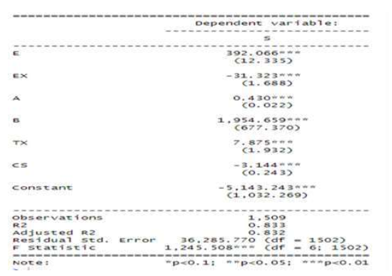
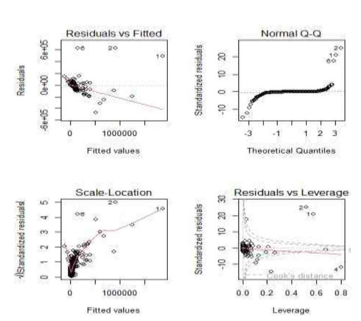
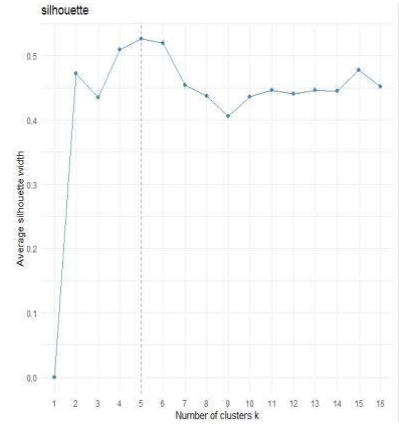

# Statistical Analysis of Italian Electrical Equipment Companies

## Overview

This project was originally completed in **2023** as part of the **Statistics for Management** course within the Entrepreneurship & Innovation program at the University of Padova.

The analysis examines a sample of active electrical-equipment manufacturing companies located in three Italian regions:

- Lombardia
- Lazio
- Puglia

The project applies two statistical methods in R:

1. Multiple Linear Regression
2. K-means Clustering

The objective was to explore factors associated with company sales and identify distinct groups of companies based on profitability and branch-network characteristics.

---

## Dataset

The dataset was obtained from the **Orbis database** and contains **1,509 active companies observed in 2021**, with 18 available variables.

Regional distribution:

- Lombardia: 1,273 companies
- Lazio: 148 companies
- Puglia: 88 companies

The original academic analysis excluded inactive companies and companies with unknown status.

---

## Research Questions

The project focused on two analytical questions:

**1. Which company-level financial and operational variables are associated with sales?**

**2. Can companies be grouped into meaningful segments based on profit margin and number of branches?**

---

# 1. Multiple Linear Regression

Sales were modeled as the dependent variable.

The predictors included:

- Number of employees
- Financial expenses
- Total assets
- Number of branches
- Taxation
- Cash flow

The estimated model achieved:

- **R² ≈ 0.833**
- **Adjusted R² ≈ 0.832**
- **F-statistic ≈ 1246**
- **Overall model p-value < 2.2e-16**

The model therefore explained a substantial proportion of the observed variation in company sales within the analyzed sample.



## Interpretation

Several predictors showed statistically significant associations with company sales.

For example, the number of branches and number of employees showed positive coefficients in the fitted model, while financial expenses and cash flow showed negative coefficients.

These relationships should be interpreted as **statistical associations rather than causal effects**.

Because the predictors are measured using different units and scales, raw regression coefficients should not be directly compared to determine which variable is the "most important."

---

# 2. Regression Diagnostics

Regression diagnostic plots were examined to assess the assumptions and behavior of the fitted model.

The analysis included:

- Residuals vs Fitted
- Normal Q-Q
- Scale-Location
- Residuals vs Leverage



The diagnostic plots indicated potential outliers and influential observations, suggesting that the strong model fit should still be interpreted with appropriate caution.

---

# 3. K-Means Clustering

A second part of the analysis used **K-means clustering** to explore company segmentation.

The clustering analysis focused on:

- Profit margin
- Number of branches

## Selecting the Number of Clusters

The **Silhouette Method** was used to compare potential values of `k`.

The analysis identified:

**k = 5**

as the preferred number of clusters based on the highest average silhouette width.



---

## Cluster Results

The resulting segmentation divided the 1,509 companies into five groups with different combinations of profit margin and branch-network characteristics.


The analysis revealed that companies with larger branch networks formed a distinct group, while other clusters represented companies with different profitability and expansion profiles.

The clustering results are descriptive and should not be interpreted as evidence that increasing the number of branches will necessarily cause higher profitability or sales.

---

## Key Takeaways

- The multiple regression model explained approximately **83% of the observed variation in sales** within the analyzed sample.
- The overall regression model was statistically significant.
- Several financial and operational variables showed statistically significant associations with company sales.
- Regression diagnostics indicated potential outliers and influential observations.
- K-means clustering identified **five distinct company groups** based on profit margin and number of branches.
- The project illustrates how regression and unsupervised learning can complement each other when analyzing company-level business data.

---

## Limitations

This was an academic exploratory analysis based on observational company data.

The regression results identify associations rather than causal relationships.

The strong model fit should also be interpreted alongside the regression diagnostic results, which suggested the presence of outliers and potentially influential observations.

The regional sample is highly unbalanced, with most observations coming from Lombardia.

The clustering analysis describes naturally occurring patterns in the selected variables but does not demonstrate that one business strategy causes superior performance.

---

## Original Report

The complete academic report is available in the `report/` folder.

> **Note:** The original R source code used for this 2023 project is no longer available. The methodology, statistical outputs, diagnostic plots, clustering results, and original interpretation are preserved in the academic report.

---

## Repository Structure

```text
italy-electrical-equipment-statistical-analysis/
│
├── README.md
├── report/
│   └── Data Analysis project withR.pdf
└── visuals/
    ├── regression_results.png
    ├── regression_diagnostics.png
    ├── silhouette_analysis.png
    └── cluster_plot.png

---
## Tools & Methods

Multiple Linear Regression
Regression Diagnostics
K-means Clustering
Silhouette Analysis

----
## Author
Mostafa Soliman Donia
